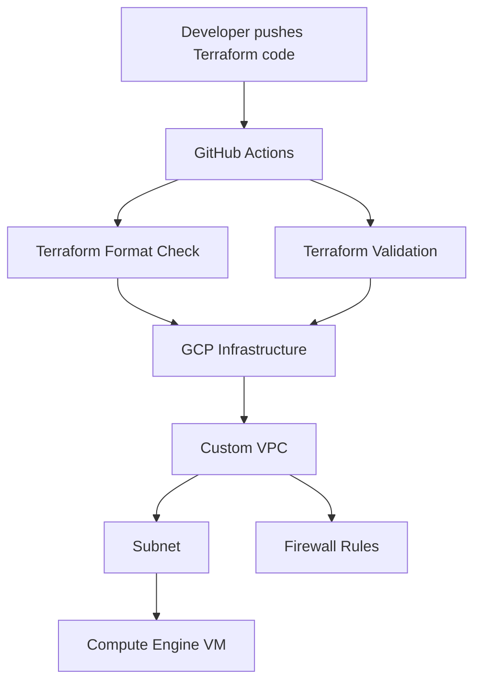

# GCP Infrastructure Automation with Terraform

[](https://github.com/ummadisettisindhuja2-netizen/gcp-terraform-infrastructure/actions/workflows/terraform.yml)

This project demonstrates how to automate Google Cloud infrastructure using Terraform. It creates a custom VPC network, subnet, firewall rules, and a Compute Engine virtual machine.

## Architecture



## Resources Defined

- Custom GCP VPC network
- Regional subnet
- Firewall rules
- Compute Engine virtual machine
- Terraform variables and outputs
- Automated Terraform validation with GitHub Actions

## Project Structure

- `main.tf` – Defines the GCP infrastructure
- `variables.tf` – Declares input variables
- `outputs.tf` – Defines Terraform outputs
- `versions.tf` – Configures Terraform and the Google provider
- `terraform.tfvars.example` – Example variable values
- `.github/workflows/terraform.yml` – Terraform CI workflow
- `.gitignore` – Prevents sensitive Terraform files from being committed

## CI Workflow

Whenever code is pushed or a pull request is opened, GitHub Actions:

1. Checks out the repository
2. Installs Terraform
3. Checks Terraform formatting
4. Initializes Terraform without a remote backend
5. Validates the Terraform configuration

## Usage

```bash
terraform init
terraform fmt
terraform validate
terraform plan
terraform apply
```

Create a `terraform.tfvars` file using `terraform.tfvars.example` and replace the sample project ID with your actual GCP project ID.

## Important Note

The Terraform configuration has been automatically formatted and validated through GitHub Actions. Creating real GCP resources requires a GCP project, billing configuration, authentication, and running `terraform apply`.

## Security

- Terraform state and credential files are excluded through `.gitignore`
- Project-specific values are supplied through variables
- Infrastructure changes can be reviewed before deployment
- Firewall access should be restricted according to production requirements

## License

This project is licensed under the MIT License.
